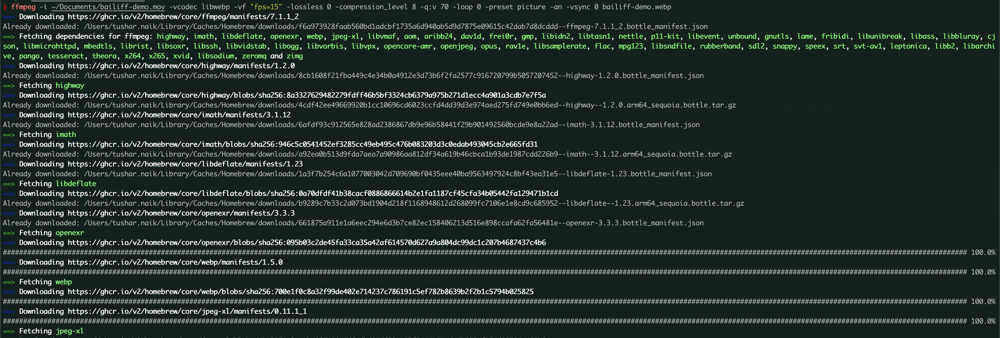

# Bailiff

> Summon your CLI tools on demand, right when they're needed.

Bailiff is a lightweight tool manager for your shell environment that ensures CLI tools are installed just when you need them - with minimal impact on your terminal startup time.

## Motivation

### 1. zsh: command not found: jq

Typically when you type a command that is not installed, you get a message like this:

```bash
btop
zsh: command not found: btop
```
Image a world, where you type the command, but when it doesn't exist, it gets installed, and your workflow resumes undisturbed.


### 2. setting up a new development environment

Moving from one Mac to another, I found myself spending a lot of time installing and managing CLI tools. Setting up a new development environment involved manually tracking down and installing dozens of utilities that I use regularly. I wanted a much simpler and cleaner way to handle these migrations.

[zinit](https://github.com/zdharma-continuum/zinit) was great for managing ZSH plugins, but I found it slightly tedious to set up for CLI tools. I wanted something similar that allowed me to:

1. Declare tool dependencies in a single configuration file
2. Install tools on-demand without slowing down shell startup
3. Work across different operating systems and package managers
4. Be lightweight and easy to understand

I created Bailiff to solve these problems with a simple, declarative approach. It is pretty much a single shell script. Rather than installing everything upfront or writing complex setup scripts, Bailiff lets you define the tools you use and handles the installation only when needed. This "lazy loading" approach means faster shell startup times and cleaner environment management.

The name "Bailiff" comes from the idea of summoning something when it's needed - just as a court bailiff brings in witnesses or evidence when called upon.


## Features

- **Zinit-like Syntax**: Simple, clean declaration of tools in your `.zshrc`
- **Smart Caching**: Checks for tools only once a month by default
- **Auto-Summoning**: Automatically installs tools when they're first used
- **Cross-Platform**: Works with Homebrew, apt, yum, pacman, and more
- **Package Manager Selection**: Specify which package manager to use for each tool
- **Customizable**: Easily override default behavior
- **Fast**: Minimal impact on shell startup time

## Installation

### Homebrew

```bash
brew install livetheoogway/bailiff/bailiff
```

### Manual Installation

```bash
# Clone the repository
git clone https://github.com/livetheoogway/bailiff.git ~/.local/share/bailifft

# Add to your .zshrc
echo 'source "$HOME/.local/share/bailiff/bailiff.sh"' >> ~/.zshrc
```

### Requirements
- ZSH (or any POSIX-compliant shell)
- A package manager (Homebrew, apt, yum, pacman, etc.) installed on your system

## Usage

### Default behaviour

If you directly type in any command that is not installed, Bailiff will try to install it for you. This is the default behavior.

```bash
# Example: typing 'btop' will trigger Bailiff to install it
nvim ~/.p10k.zsh

==> Downloading https://ghcr.io/v2/homebrew/core/neovim/manifests/0.11.1
Already downloaded: /Users/tushar.naik/Library/Caches/Homebrew/downloads/9bbfc7519393ece208bf1f4b9cdd0835d994ebd4096d2c46d983031afea68dc6--neovim-0.11.1.bottle_manifest.json
==> Fetching dependencies for neovim: lpeg, luajit, luv, tree-sitter, unibilium and utf8proc
==> Downloading https://ghcr.io/v2/homebrew/core/lpeg/manifests/1.1.0-1 ....
```


### Basic Syntax for auto installation from zshrc

If you are the sort of guy that keeps your .bash_profile or .zshrc backed up and moving across machines, this should help.

In your `.zshrc`, after sourcing Bailiff, keep these pernanently:

```bash
# Basic usage
bailiff nvim                # Command and package name are the same
bailiff rg ripgrep          # Command differs from package name
bailiff brew antibody       # Specify package manager (brew)
bailiff apt htop            # Use apt for this tool
bailiff brew rg ripgrep     # Custom package with specific manager
```

### Configuration

Configure Bailiff by setting these variables before sourcing:

```bash
# All settings are optional with these defaults
BAILIFF_CACHE_DIR="$HOME/.cache/bailiff"  # Cache directory
BAILIFF_CACHE_EXPIRY=2592000              # Cache expiry in seconds (30d)
BAILIFF_QUIET=0                           # Set to 1 to silence messages
BAILIFF_VERBOSE=0                         # Set to 1 to always show "already installed" messages
BAILIFF_AUTO_SUMMON=1                     # Auto-install missing commands

# Define command → package mappings
BAILIFF_TOOL_MAP=(
  "nvim" "neovim"
  "rg" "ripgrep"
)
```

### Common Tool Examples

```bash
# Editors
bailiff nvim                 # Neovim editor
bailiff brew macvim          # MacVim via Homebrew
bailiff brew --force vscode  # Force VS Code installation check via Homebrew

# CLI utilities
bailiff jq                   # JSON processor
bailiff htop                 # Process viewer/manager
bailiff eza                  # Modern ls replacement
bailiff bat                  # cat with syntax highlighting
bailiff fd                   # Modern alternative to find
bailiff brew ripgrep         # Fast grep alternative via Homebrew (package name)
bailiff brew rg ripgrep      # Fast grep alternative via Homebrew (command differs from package)

# Development tools
bailiff brew node            # Node.js via Homebrew
bailiff brew python          # Python via Homebrew
bailiff docker               # Docker (uses auto-detected package manager)
bailiff go                   # Go programming language
bailiff -x rustup            # Check if rustup is installed (verbose mode)

# Package manager examples
bailiff brew gh              # GitHub CLI via Homebrew
bailiff apt neofetch         # Neofetch via apt
bailiff pacman fzf           # Fuzzy finder via pacman
```

### Command-line Usage

```bash
bailiff --list          # List all summoned tools
bailiff --clear-cache   # Clear the cache
bailiff --version       # Show version
bailiff --help          # Show help
bailiff -x nvim         # Verbose mode, shows already installed tools
bailiff --force asdf    # Force check/install regardless of cache status
```

## How It Works

1. When you add `bailiff <tool>` to your `.zshrc`, each time you open a new tab, bailiff checks if the tool is already installed. If not installed and not recently checked, Bailiff attempts to install it
2. Auto-Summoning, Bailiff will also attempt to install any command that isn't found, even if not explicitly declared. 

### Universal Auto-Summoning

Bailiff includes a powerful feature that attempts to install any command that isn't found in your system, not just those explicitly declared with `bailiff <tool>`. This means:

- You don't need to pre-declare every tool you might use
- When you type a command that doesn't exist, Bailiff will try to install it automatically
- This works with any package that has the same name as its command

This feature is enabled by default. If you with to disable it, you can set `BAILIFF_AUTO_SUMMON=0` in your configuration.

It'll work when you type in a command with options. 


## Forcing Installation Checks

When Bailiff reports that a tool "was checked recently and is not installed," it means the tool wasn't found during a previous check, and Bailiff is using its cache to avoid checking again too soon.

There are two ways to force Bailiff to ignore its cache and check again:

1. **For a specific tool** (with flexible syntax):
   ```bash
   bailiff asdf --force     # The --force flag can go after the tool name
   bailiff --force asdf     # Or before the tool name
   bailiff brew asdf --force  # Works with package manager specified too
   ```
   This only clears the cache for the specified tool.

2. **For all tools**:
   ```bash
   bailiff --clear-cache
   bailiff asdf
   ```
   This clears the entire cache before checking.

The force option is useful when:
- You've manually installed a tool and want Bailiff to recognize it
- You've recently added a package source that might now have the tool
- You're testing different package managers for the same tool

Without force, Bailiff uses its cache to speed up shell startup when multiple tools are configured.

## Verbose Mode

By default, Bailiff is silent when tools are already installed to minimize noise in your terminal. There are two ways to see "already installed" messages:

1. **Command-line flag**: Use `bailiff -x nvim` to show status for a specific tool
2. **Global setting**: Add `BAILIFF_VERBOSE=1` to your configuration to always show these messages

For quick checks during setup, use the command-line flag:
```bash
bailiff -x bat     # Shows "✅ Bailiff: Tool 'bat' is already installed."
```

## Project Structure

If you're installing from source or contributing to Bailiff, here's the recommended project structure:

```
bailiff/
├── bailiff.sh                   # Main script
├── completions/
│   └── _bailiff                 # ZSH completion
├── install.sh                   # Installation script
├── LICENSE                      # License file
└── README.md                    # Documentation
```

For Homebrew distribution, create a separate repository:

```
homebrew-bailiff/
├── Formula/
│   └── bailiff.rb               # Homebrew formula
└── README.md                    # Tap documentation
```

## Comparison with Similar Tools

| Feature | Bailiff | Zinit | Homebrew | apt/yum |
|---------|---------|-------|----------|---------|
| Focus | CLI tools | ZSH plugins | Package management | System packages |
| Speed | Very fast | Fast | Slow | Slow |
| Syntax | Simple | Complex | Verbose | Verbose |
| Caching | Yes | Yes | No | No |
| Auto-install | Yes | No | No | No |

## Testing

You can test Bailiff directly from the command line:

```bash
# Test with direct execution
zsh bailiff.sh --help                   # Show help
zsh bailiff.sh --clear-cache            # Clear cache 
zsh bailiff.sh brew htop                # Install htop with Homebrew
zsh bailiff.sh -x nvim                  # Check if nvim is installed (verbose)
zsh bailiff.sh asdf --force             # Force check for asdf even if recently checked

# Test by sourcing (preferred method)
source bailiff.sh                       # Loads bailiff without displaying help
bailiff --list                          # List installed tools
bailiff brew antibody                   # Install antibody with Homebrew
bailiff rg --force                      # Force check for ripgrep
bailiff --force brew asdf               # Force check with package manager specified
```

**Important**: When sourcing the script in your `.zshrc` or interactively, no help text is displayed. The help will only appear when running the command with no arguments (`bailiff`) after sourcing.

## License

MIT
